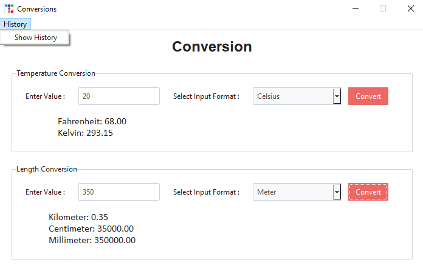
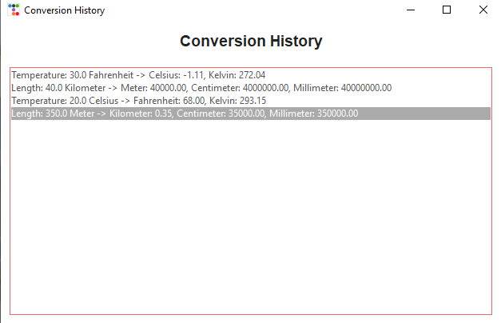

# conversion-tool_tkinter 

## About the project

This project is a simple GUI-based Conversion Tool created using Python's tkinter library and ttkbootstrap. It provides users the ability to convert between different units of temperature (Celsius, Fahrenheit, and Kelvin) and length (Meter, Kilometer, Centimeter, and Millimeter). Additionally, it keeps a record of each conversion made and allows the user to view the conversion history.

##  Project Requirements

### Libraries
To run this project, you need to have Python 3.x installed, along with the following Python libraries:
- 'tkinter': Standard library for creating graphical user interfaces in Python. 
- 'ttkbootstrap': A library for creating modern, styled GUI components using tkinter.  

### File Requirements

- 'history.txt': A text file used for storing the conversion history. The file will be created automatically upon the first run if it doesn't exist.

## Features & Usage

### Features
- Input Fields: Allows users to input numeric values for conversion.

- Dropdown Menus: For selecting the units of temperature or length to convert from.

- Conversion Button: Converts the input value to the desired units and displays the result.

- History Menu: Shows a list of all previous conversions.

- Data Persistence: Conversion history is saved to a text file (history.txt) and is loaded every time the program is launched.

### Usage
- Temperature Conversion: Enter a value, select the input unit (Celsius, Fahrenheit, or Kelvin), and click "Convert". The results will be displayed for the other two units.

- Length Conversion: Enter a value, select the input unit (Meter, Kilometer, Centimeter, or Millimeter), and click "Convert". The results for the other three units will be displayed.

- View History: Access the conversion history by clicking on the "History" menu and selecting "Show History".

### Images

